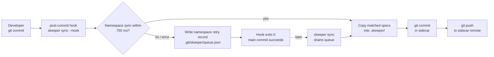

<div align="center">
  <p>
    
  </p>
  <p>
    <a href="https://github.com/compozy/skeeper/actions/workflows/ci.yml">
      
    </a>
    <a href="https://pkg.go.dev/github.com/compozy/skeeper">
      
    </a>
    <a href="https://goreportcard.com/report/github.com/compozy/skeeper">
      
    </a>
    <a href="LICENSE">
      
    </a>
    <a href="https://github.com/compozy/skeeper/releases">
      
    </a>
  </p>
</div>

Specs and code want to live together. Spec files (`SPEC.md`, `docs/specs/*`, `.claude/plans/*`, ADRs, RFCs) belong next to the code they describe — but committing them to your main repo bloats every PR with documentation noise, and ignoring them loses history. `skeeper` runs a sidecar Git repository that mirrors matched spec files on every commit. You edit specs at their natural paths, your main PRs stay focused on code, and a separate Git history keeps full `git log`, `git blame`, and branch-aware versioning of every spec change. One `skeeper init` and the post-commit hook does the rest — without ever blocking your `git commit`.

## ✨ Highlights

- **One sidecar repo, full Git history.** Specs version normally — `git log`, `git blame`, branches, PRs — without touching your main repo's diff.
- **Shared sidecars without collisions.** Named namespaces isolate stored paths and pushed branches inside one sidecar remote.
- **Edit specs where they belong.** Spec files stay next to the code they describe. `skeeper` mirrors them into `.skeeper/` for you.
- **A post-commit hook that never breaks your commit.** 750 ms foreground budget per namespace; on failure, the sync queues locally and retries on the next manual `skeeper sync`.
- **Branch-aware mirroring.** Sidecar branches track main-tree branches, so feature work and `main` stay isolated.
- **Fresh-clone hydration.** `skeeper hydrate` restores matched specs into a new clone so teammates start with full context.
- **Glob-based pattern matching.** Doublestar globs (`**/SPEC.md`, `docs/specs/**`, `.claude/plans/**`) — match specs the way you actually organize them.
- **Shells out to `git` and `gh`.** Reuses your existing GitHub auth. Every operation is debuggable with the same Git commands you already know.
- **Single static binary, zero runtime deps.** Linux, macOS, Windows on amd64/arm64. CGO disabled.

## 📦 Installation

#### Homebrew

```bash
brew tap compozy/compozy
brew install --cask skeeper
```

#### NPM

```bash
npm install -g @compozy/skeeper
```

#### Go

```bash
go install github.com/compozy/skeeper/cmd/skeeper@latest
```

#### From Source

```bash
git clone git@github.com:compozy/skeeper.git
cd skeeper && make verify && go build -o bin/skeeper ./cmd/skeeper
```

#### Docker

```bash
git clone git@github.com:compozy/skeeper.git
cd skeeper && make docker-build      # builds skeeper:dev (distroless, nonroot)
docker run --rm -v "$PWD:/workspace" -w /workspace skeeper:dev status
```

#### Prerequisites

- `git` on `PATH`
- `gh` (GitHub CLI) **only when `skeeper init` creates a new sidecar** — existing sidecars can be reused with `--sidecar`. Day-to-day commands need only `git`.

## 🤖 Official Agent Skill

`skeeper` ships its own first-party agent skill at [`skills/skeeper-project/SKILL.md`](skills/skeeper-project/SKILL.md). LLM agents working in this repository should load it before reading or modifying code — it captures the workflow, project rules, and verification gates that aren't obvious from the source alone, and points to `references/domain-map.md` and `references/repo-contract.md` for package boundaries and change rules.

## 🔄 How It Works

Spec files live at their natural paths next to code. Your main repo's `.gitignore` lists the effective namespace patterns plus `.skeeper/`, so neither owned specs nor the sidecar clone ever appear in a main-repo diff.

On every `git commit`, the managed post-commit hook runs `skeeper sync --hook` with a 750 ms foreground budget per namespace. `skeeper` matches files against namespace patterns, copies them into `.skeeper/`, commits with a reference to the main commit SHA, and pushes to the sidecar remote.

Each namespace stores files under `<namespace>/<path>` in the sidecar and pushes branch `<namespace>/__branches__/<source-branch>`. For example, namespace `skills` on source branch `main` stores `skills/review.md` as `skills/skills/review.md` and pushes sidecar branch `skills/__branches__/main`.

If anything fails — network, auth, push rejection, timeout — `skeeper` writes a retry record to `.git/skeeper/queue.json` with the failing namespace when one is known, appends a one-line audit entry to `.git/skeeper/sync.log`, and exits 0 so your `git commit` always succeeds. Run `skeeper sync` later to drain the queue.



## ⚙️ Configuration

`skeeper init` writes `.skeeper.yml` at the repo root. Commit it — your teammates need it for `skeeper hydrate`.

```yaml
# Required: sidecar repository URL
sidecar: git@github.com:user/myproject-specs.git

# Required: namespaces route files into sidecar paths and branches
namespaces:
  - name: skills
    patterns:
      - "skills/*.md"

  - name: myproject
    patterns:
      - "**/SPEC.md"
      - "docs/specs/**"
      - ".claude/plans/**"
      - "**/*.spec.md"
    exclude:
      - "skills/*.md"

# Optional: install one-liner shown to teammates after `skeeper hydrate`
bootstrap: brew tap compozy/compozy && brew install --cask skeeper
```

Unknown keys are rejected — config errors fail loud, not silently.

Every namespace needs a `name` and at least one `patterns` glob. `exclude` removes ownership from that namespace; if another namespace owns the excluded files, they stay tracked there. A file owned by more than one namespace is a configuration error because hidden precedence would make deletes unsafe.

`skeeper init` writes one namespace by default. Add more namespaces by editing `.skeeper.yml`.

Local-only state lives under `.git/skeeper/` (already gitignored by Git's hooks directory):

| File         | Purpose                                                |
| ------------ | ------------------------------------------------------ |
| `queue.json` | Pending retries from failed hook runs                  |
| `sync.log`   | Append-only audit log of sync attempts and error codes |

## 🚀 Quick Start

### 1. Install

```bash
go install github.com/compozy/skeeper/cmd/skeeper@latest
```

### 2. Initialize the sidecar

In a Git repo where you want to track specs:

```bash
skeeper init
```

Interactive by default — opens a terminal form for the sidecar mode, repository name or URL, namespace, bootstrap command, and optional extra context globs. The interactive flow always includes the default spec globs (`**/SPEC.md`, `docs/specs/**`, `.claude/plans/**`, and `**/*.spec.md`) in the initial namespace; the extra context prompt starts empty and is only for additional folders or files you explicitly want in that namespace. Or pass values as flags:

```bash
skeeper init \
  --sidecar-name myproject-specs \
  --visibility private \
  --namespace myproject \
  --patterns "**/SPEC.md" \
  --patterns ".claude/plans/**"
```

To reuse one shared sidecar remote across multiple source repos:

```bash
skeeper init \
  --sidecar git@github.com:user/shared-specs.git \
  --namespace myproject \
  --patterns "**/SPEC.md"
```

`skeeper init` creates the GitHub repo with `gh repo create` unless `--sidecar` points to an existing remote. It clones the sidecar into `.skeeper/`, writes `.skeeper.yml`, updates `.gitignore`, and installs the post-commit hook. New init defaults the namespace to the source repo name.

When using flags, repeated `--patterns` values are the complete pattern set written to `.skeeper.yml`; they do not append to the interactive defaults.

### 3. Edit specs and commit normally

```bash
$EDITOR src/auth/SPEC.md
git add .
git commit -m "auth: design OAuth provider flow"
```

The hook fires automatically. No extra step.

### 4. Inspect

```bash
skeeper status                       # sidecar URL, branch mapping, last sync, pending count
skeeper log src/auth/SPEC.md         # sidecar Git history for one file
```

### 5. Onboard a teammate

```bash
git clone git@github.com:user/myproject.git
cd myproject
skeeper hydrate
```

`hydrate` clones the sidecar into `.skeeper/`, restores matched specs into the working tree, and installs the hook.

### 6. Recover from a failed sync

If the hook ever queued work (network blip, push rejection):

```bash
skeeper sync           # drain queued retries, then run a fresh sync
skeeper sync --pull    # rebase the sidecar branch first — useful when teammates pushed
```

## 🧰 How Sync Works

The post-commit hook is a _managed block_ in `.git/hooks/post-commit`, installed idempotently. It runs `skeeper sync --hook` with a 750 ms foreground budget per namespace so your `git commit` stays bounded even on a slow network.

On the success path, `skeeper` matches files with doublestar globs, copies them into `.skeeper/`, then runs `git add`, `git commit`, and `git push` against the sidecar remote. Each namespace copies to `.skeeper/<namespace>/<path>` and pushes `<namespace>/__branches__/<source-branch>`. Sidecar commits reference the main-repo SHA so you can correlate spec changes back to the code change that triggered them.

On the failure path — timeout, auth failure, network failure, or push rejection — `skeeper` writes a retry record to `.git/skeeper/queue.json` with the failing namespace when one is known, appends to `.git/skeeper/sync.log`, prints a one-line note, and the hook exits 0. The next `skeeper sync` drains the queue before running a normal sync. Use `skeeper sync --pull` when a teammate pushed sidecar updates between your commits; it fetches and rebases before pushing.

This design has two consequences worth knowing:

- **`git commit` never fails because of `skeeper`.** Worst case, you have queued work to drain.
- **Conflicts surface as Git conflicts.** `skeeper sync --pull` stops if the rebase reports unresolved conflicts; resolve them in `.skeeper/` with normal Git tooling, then re-run.

## 📖 CLI Reference

<details>
<summary><code>skeeper init</code> — Create and connect a sidecar specs repository</summary>

```bash
skeeper init [flags]
```

| Flag             | Default   | Description                                                  |
| ---------------- | --------- | ------------------------------------------------------------ |
| `--sidecar`      |           | Existing sidecar repository URL                              |
| `--sidecar-name` |           | GitHub sidecar repository name or `OWNER/REPO`               |
| `--visibility`   | `private` | GitHub visibility: `private`, `public`, or `internal`        |
| `--namespace`    | repo slug | Initial sidecar namespace for this source repo               |
| `--bootstrap`    |           | Optional install command stored in `.skeeper.yml`            |
| `--patterns`     |           | Complete spec glob pattern set; repeat for multiple patterns |

When run interactively, `init` opens a terminal form. It includes the default spec globs automatically, then asks whether to add extra context globs such as `AGENTS.md`, `CLAUDE.md`, or `.codex/plans/**`. It runs `gh repo create` for `--sidecar-name` or the create mode, but skips GitHub creation when `--sidecar` is provided. `--sidecar` and `--sidecar-name` are mutually exclusive.

</details>

<details>
<summary><code>skeeper hydrate</code> — Restore spec files from the sidecar repository</summary>

```bash
skeeper hydrate
```

Use after a fresh clone of the main repo. `hydrate` clones the sidecar into `.skeeper/`, copies matched spec files into the working tree, and installs the post-commit hook. No flags.

</details>

<details>
<summary><code>skeeper sync</code> — Mirror spec files into the sidecar repository</summary>

```bash
skeeper sync [flags]
```

| Flag     | Default | Description                                                                          |
| -------- | ------- | ------------------------------------------------------------------------------------ |
| `--pull` | `false` | Pull and rebase the sidecar branch before syncing                                    |
| `--hook` | `false` | Run in post-commit hook mode: 750 ms foreground budget per namespace, always exits 0 |

Drains queued retries from `.git/skeeper/queue.json`, then mirrors spec files into `.skeeper/`, commits, and pushes. Use `--pull` when teammates may have pushed sidecar updates between your commits. `--hook` is what the installed post-commit hook calls — you rarely run it manually.

</details>

<details>
<summary><code>skeeper status</code> — Show sidecar sync status</summary>

```bash
skeeper status
```

Prints the sidecar URL, current source branch, one status block per namespace, last sync commit and age, remote state, tracked file counts, and pending queued syncs. No flags.

</details>

<details>
<summary><code>skeeper log &lt;path&gt;</code> — Show sidecar history for a spec file</summary>

```bash
skeeper log <path>
```

Runs `git log` against the sidecar for one spec file. The path is relative to the main repo root, e.g. `skeeper log src/auth/SPEC.md`. `skeeper` resolves the current owning namespace and reads `<namespace>/<path>` inside that namespace branch.

</details>

<details>
<summary><code>skeeper version</code> — Print build metadata</summary>

```bash
skeeper version
```

Prints `Version`, `Commit`, and `BuildDate` injected at build time via ldflags.

</details>

## 🛠️ Development

```bash
mise install      # provision Go 1.26.2, Bun 1.3.4, and CLI tools
bun install
make hooks-install
make verify       # fmt → lint → test → build (BLOCKING gate)
```

Common targets:

```bash
make fmt          # gofmt every .go file
make lint         # golangci-lint v2 + gopls modernize (zero tolerance)
make test         # gotestsum + -race -parallel=4
make build        # bin/skeeper with version ldflags
make cover        # coverage.out + coverage.html
```

Releases are prepared through release pull requests and published with [GoReleaser Pro](.goreleaser.yml). A push to `main` creates or updates a release PR with `pr-release`; the release PR runs a GoReleaser dry run, and merging the release commit publishes GitHub release artifacts, the Homebrew cask, and the NPM package.

Release publishing requires these GitHub Actions secrets:

| Secret           | Purpose                                                       |
| ---------------- | ------------------------------------------------------------- |
| `RELEASE_TOKEN`  | Create/update release PRs, push release tags, update Homebrew |
| `GORELEASER_KEY` | Run GoReleaser Pro                                            |
| `NPM_TOKEN`      | Publish `@compozy/skeeper` and authenticate npm in release CI |

Release notes are generated by `pr-release`. Add pending human-authored notes under `.release-notes/`; the release PR writes the current release body to `RELEASE_BODY.md` and prepends it to `RELEASE_NOTES.md`. The production workflow passes `RELEASE_BODY.md` to GoReleaser with the Skeeper release header and footer templates.

Local release checks:

```bash
make release-snapshot  # requires GoReleaser Pro in PATH, or GORELEASER_KEY for the installer
```

Contributor guidance, commit conventions, and the agent skill dispatch protocol live in [`CLAUDE.md`](CLAUDE.md) and [`AGENTS.md`](AGENTS.md).

## 🤝 Contributing

Contributions are welcome. Open an issue to discuss larger changes, or send a pull request for fixes and small improvements. All commits follow [Conventional Commits](https://www.conventionalcommits.org/) (`build`, `chore`, `ci`, `docs`, `feat`, `fix`, `perf`, `refactor`, `test`), enforced by `commitlint`.

## 📄 License

[MIT](LICENSE)
