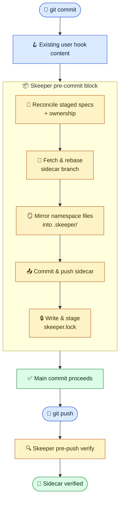

<div align="center">
  <p>
    
  </p>
  <p>
    <a href="https://github.com/compozy/skeeper/actions/workflows/ci.yml">
      
    </a>
    <a href="https://pkg.go.dev/github.com/compozy/skeeper">
      
    </a>
    <a href="LICENSE">
      
    </a>
    <a href="https://github.com/compozy/skeeper/releases">
      
    </a>
  </p>
</div>

Spec docs drift from code, or they bloat every PR. Skeeper picks neither.

It mirrors `SPEC.md`, ADRs, RFCs, and AI plan files into a sidecar Git repository and commits a tiny `skeeper.lock` to your main repo that pins every commit to exact sidecar commits. PR diffs stay focused on code, spec history stays auditable, and nothing silently drifts because the managed Git hooks fail the commit if the sidecar state cannot be proven.

## ✨ Highlights

- **Lockfile-backed reliability.** `skeeper.lock` records sidecar URL, source branch, namespace branch, sidecar commit, per-namespace digest, file count, and byte count.
- **Strict managed hooks.** The managed `pre-commit` and `pre-merge-commit` hooks sync staged content, push the sidecar, write and stage `skeeper.lock`, and fail closed. The managed `pre-push` hook verifies the lock against the sidecar remote.
- **Specs stay local to their code.** Edit `SPEC.md`, `docs/specs/**`, `.claude/plans/**`, ADRs, RFCs, or custom globs where they naturally belong.
- **Shared sidecars without collisions.** Namespaces isolate stored paths and sidecar branches inside one sidecar remote.
- **Branch-aware history.** Namespace branches use `<namespace>/__branches__/<source-branch>`.
- **Fresh-clone hydration.** `skeeper hydrate` restores files from the locked sidecar commits, not a best-effort latest branch.
- **Safe reconciliation.** `hydrate`, `fsck`, `diff`, and `reconcile` classify per-path drift before any local managed document is overwritten or moved.
- **Agent-friendly commands.** `status`, `sync`, `verify`, `fsck`, `diff`, `reconcile`, `update`, `hooks check`, `repair status`, `rescue`, `pattern`, `adopt`, and `untrack` all support deterministic output where needed.
- **Skill for AI agents.** A bundled skill at [`.agents/skills/skeeper/SKILL.md`](.agents/skills/skeeper/SKILL.md) teaches coding agents the strict-sync workflow, namespaces, and recovery commands.

## 🎯 Who Is This For

- Teams using AI coding agents that produce `SPEC.md`, PRD, TechSpec, and plan markdown next to code.
- Engineering organizations running ADRs, RFCs, and design docs in-repo without making every PR a docs+code review.
- Solo developers who want full spec history (`git log`, `git blame`, branches, PRs) without polluting their main repository's diff.

## 📦 Installation

```bash
go install github.com/compozy/skeeper/cmd/skeeper@latest
```

Other release channels are available through GitHub Releases, Homebrew, NPM, and the distroless Docker image.

Prerequisites:

- `git` on `PATH`
- `gh` only when `skeeper init` creates a new GitHub sidecar repo

## 🔄 How It Works

Spec files live in the main worktree but are ignored by the main repository through a managed `.gitignore` block. The sidecar repository stores mirrored files under `<namespace>/<path>` and pushes them to `<namespace>/__branches__/<source-branch>`.

On commit, the managed `pre-commit` block runs last. On automatic merge commits, the managed `pre-merge-commit` block runs the same strict sync path because Git does not run `pre-commit` for merge commits. Both hooks build a plan from the staged index plus explicitly owned ignored/untracked spec paths, fetch and rebase sidecar branches, mirror content into `.skeeper/`, commit and push the sidecar, write `skeeper.lock`, and stage that lock before Git creates the main commit.



If sync fails, the commit fails. This is intentional: a committed main change should not silently drift from the sidecar. The audited bypass is `SKEEPER_SKIP=1`; it records `.git/skeeper/bypass.json`, prints a warning, and `pre-push`, `status`, `fsck`, and `verify` continue to surface stale-lock diagnostics until `skeeper sync` repairs the state. `git commit --no-verify` is unsupported because Git skips all hook code and cannot record an audit trail.

## ⚙️ Configuration

`skeeper init` writes `.skeeper.yml` at the repository root. Commit it.

```yaml
sidecar: git@github.com:user/myproject-specs.git

namespaces:
  - name: project
    patterns:
      - "**/SPEC.md"
      - "docs/specs/**"
      - ".claude/plans/**"
      - "**/*.spec.md"
    exclude:
      - "docs/specs/private/**"
```

Advanced operational defaults are optional:

```yaml
settings:
  guardrails:
    max_files: 100
    max_bytes: 10485760
  hooks:
    pre_push_timeout: 30s
    allow_skip_env: SKEEPER_SKIP

namespaces:
  - name: generated
    patterns:
      - "generated/specs/**"
    respect_gitignore: false
```

Rules:

- Unknown keys are rejected.
- Every namespace needs a `name` and at least one glob in `patterns`.
- `exclude` is the only public exclusion mechanism. Negative globs in `patterns` are rejected.
- Ownership must be unique. If two namespaces own the same file, the plan fails and asks for an `exclude` fix.
- `respect_gitignore: false` bypasses root `.gitignore`, nested `.gitignore`, `.git/info/exclude`, and global excludes for that namespace. `.git/` and `.skeeper/` are always excluded.

Local-only state lives under `.git/skeeper/`:

| File               | Purpose                                        |
| ------------------ | ---------------------------------------------- |
| `transaction.json` | Current resumable mutating operation and phase |
| `bypass.json`      | Latest audited strict-hook bypass              |
| `hydration.json`   | Last locked sidecar blobs hydrated locally     |
| `rescue/`          | Local files moved aside before prune/overwrite |

## 🚀 Quick Start

```bash
skeeper init
```

Interactive init asks for the sidecar mode, repository name or URL, namespace, bootstrap command, and optional extra context globs. With flags:

```bash
skeeper init \
  --sidecar-name myproject-specs \
  --visibility private \
  --namespace project \
  --patterns "**/SPEC.md" \
  --patterns "docs/specs/**"
```

Use an existing shared sidecar:

```bash
skeeper init \
  --sidecar git@github.com:user/shared-specs.git \
  --namespace project \
  --patterns "**/SPEC.md"
```

Then edit specs and commit normally:

```bash
$EDITOR src/auth/SPEC.md
git add src/auth/service.go src/auth/SPEC.md
git commit -m "auth: design OAuth provider flow"
```

The `pre-commit` and `pre-merge-commit` hooks mirror specs and stage `skeeper.lock`. If a hook stages a new lock, review it and include it in the commit.

## 🛟 Failed Sync Recovery

Inspect local repair state:

```bash
skeeper repair status
```

Resume the recorded operation when network/auth/sidecar contention has been fixed:

```bash
skeeper repair resume
```

Abort only before the main index has been mutated:

```bash
skeeper repair abort
```

Run a fresh repair sync when a bypass or stale lock is reported:

```bash
skeeper sync
skeeper verify
```

## 📖 CLI Reference

```bash
skeeper init [flags]
skeeper sync [--dry-run] [--json] [--commit --message <msg>] [--force]
skeeper adopt <path-or-glob>... [--dry-run] [--json] [--force] [--commit --message <msg>]
skeeper untrack <path-or-glob>... [--dry-run] [--json] [--force] [--commit --message <msg>]
skeeper pattern test <glob> [--namespace <name>] [--json]
skeeper pattern add <glob> [--namespace <name>] [--exclude <glob>]... [--adopt-existing] [--dry-run] [--json] [--force] [--commit --message <msg>]
skeeper hydrate [--dry-run] [--json] [--keep-local|--adopt-local|--prune-local|--merge] [--ours|--theirs]
skeeper reconcile [--dry-run] [--json] [--adopt-local|--prune-local|--merge] [--ours|--theirs]
skeeper diff [--json] [--namespace <name>] [--class <class>] [--extra] [--missing] [--modified]
skeeper rescue list [--json]
skeeper rescue restore <id> [path...] [--json] [--overwrite]
skeeper update [--json] [--no-git] [--reconcile <report|keep-local|adopt-local|prune-local|merge>] [--ours|--theirs]
skeeper status [--json]
skeeper log <path> [--latest]
skeeper fsck [--json] [--source-branch <branch>]
skeeper verify [--json] [--source-branch <branch>]
skeeper hooks install [--json]
skeeper hooks check [--json]
skeeper merge-driver [--json]
skeeper repair status|resume|abort [--json]
skeeper version
```

Command notes:

- `sync` uses working-tree content and stages `skeeper.lock`. Hook mode uses staged index content.
- `adopt` and `untrack` push sidecar coverage before removing main-index tracking.
- `pattern add --adopt-existing` updates `.skeeper.yml`, updates the managed `.gitignore` block, then runs the same adoption transaction.
- `verify` checks `skeeper.lock` against the sidecar remote and does not require hooks.
- `fsck` compares current working-tree specs against locked sidecar content, reports exact drift paths, and does not mutate files or refs.
- `hydrate` restores from locked sidecar commits by default, but fails closed if local managed files would be overwritten or orphaned.
- `reconcile` is the explicit status/add/merge equivalent for managed documents. Use `--adopt-local` to publish local-only files, or `--prune-local` to move them to `.git/skeeper/rescue/<id>/` before restoring.
- `diff` lists per-path drift classes such as `local_only`, `missing_local`, `local_modified`, and `both_modified_conflict`.
- `update` is the high-level clone workflow for agents: safe fast-forward, verify, hydrate, fsck, and hook validation.
- `log --latest` fetches the namespace branch and reads its latest history instead of the locked commit.
- `hooks install` removes legacy Skeeper post-commit blocks, installs strict pre-commit/pre-merge-commit/pre-push blocks, writes `.gitattributes`, and configures the `skeeper.lock` merge driver.

## 🤖 CI Action

Use the same-repository Action to verify `skeeper.lock` in CI:

```yaml
name: skeeper

on:
  pull_request:
  push:
    branches: [main]

jobs:
  verify:
    runs-on: ubuntu-latest
    steps:
      - uses: actions/checkout@v4
        with:
          fetch-depth: 0
      - uses: compozy/skeeper@v0.1.1
        with:
          args: |
            verify
            --json
          ssh-private-key: ${{ secrets.SKEEPER_SSH_PRIVATE_KEY }}
```

Credential precedence:

1. `ssh-private-key` writes a temp key and sets `GIT_SSH_COMMAND`.
2. `token` configures HTTPS GitHub credentials.
3. Existing runner Git/SSH credentials are used when neither input is provided.

Secrets are masked before configuration. The wrapper downloads the released Skeeper binary for the action ref/tag and delegates verification to the CLI.

## 🩺 Troubleshooting

**`SKEEPER_SKIP=1` was used**

Run `skeeper status`, then `skeeper sync`, then `skeeper verify`. The bypass journal remains visible until sync clears it.

**Sidecar push was rejected**

Run `skeeper repair status`. If the failure happened before main-index mutation, fix network/auth or sidecar contention and run `skeeper repair resume`. If the main index was already mutated, inspect the listed files manually.

**`skeeper.lock` conflicts during merge**

Run `skeeper hooks install` to ensure the merge driver is configured, then rerun the merge. Manual editing of scalar sidecar SHAs is unsupported; regenerate the lock through `skeeper merge-driver` or `skeeper sync`.

**`skeeper hydrate` is blocked by local managed files**

Run `skeeper diff` to inspect exact paths. Use `skeeper reconcile --adopt-local` when the local files should be published into the sidecar, or `skeeper reconcile --prune-local` when they should be moved to rescue before restoring the locked content. Use `skeeper rescue list` and `skeeper rescue restore <id>` to recover pruned files.

**`verify` reports a lock mismatch**

The main commit and sidecar remote disagree. Run `skeeper sync`, include the updated `skeeper.lock`, and rerun `skeeper verify`.

**A namespace overlaps another namespace**

Move shared files into exactly one namespace by adding `exclude:` entries. Skeeper does not use order-based precedence.

## 🚫 When Skeeper Is the Wrong Tool

- Repositories where specs already belong in the main diff and reviewers explicitly want them inline.
- Teams that need PR review on the spec content itself before merge — Skeeper mirrors after the main commit succeeds, by design.
- Repositories without a stable sidecar Git host: Skeeper fails the commit when the sidecar is unreachable (the audited `SKEEPER_SKIP=1` bypass exists, but it is not a substitute for a working remote).
- Storing build artifacts, generated code, or large binaries. Default guardrails cap mutating plans at 100 files and 10 MiB on purpose.

## 🛠️ Development

```bash
mise install
bun install
make hooks-install
make verify
```

Common targets:

```bash
make fmt
make lint
make test
make build
make cover
make release-snapshot
```

Contributor guidance, commit conventions, and agent instructions live in [`CLAUDE.md`](CLAUDE.md) and [`AGENTS.md`](AGENTS.md).

## 📄 License

[MIT](LICENSE)
