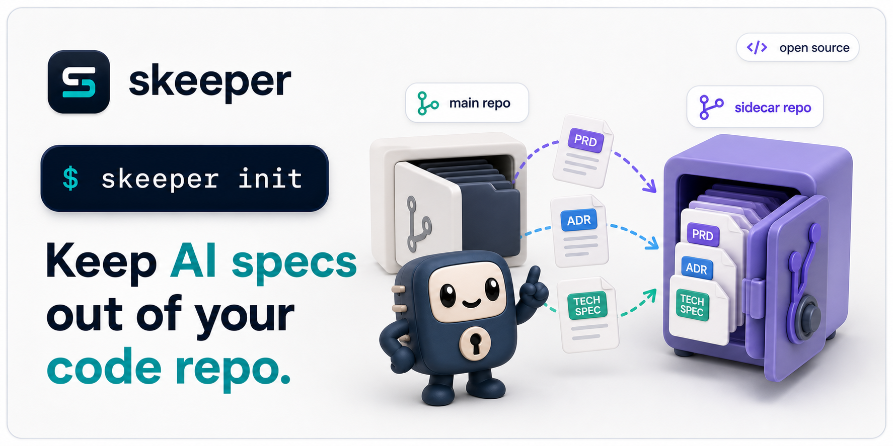
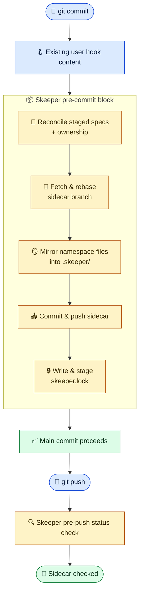

<div align="center">
  <p>
    
  </p>
  <p>
    <a href="https://github.com/compozy/skeeper/actions/workflows/ci.yml">
      
    </a>
    <a href="https://pkg.go.dev/github.com/compozy/skeeper">
      
    </a>
    <a href="LICENSE">
      
    </a>
    <a href="https://github.com/compozy/skeeper/releases">
      
    </a>
  </p>
</div>

Spec docs drift from code, or they bloat every PR. Skeeper picks neither.

It mirrors `SPEC.md`, ADRs, RFCs, and AI plan files into a sidecar Git repository and commits a tiny `skeeper.lock` to your main repo that pins every commit to exact sidecar commits. PR diffs stay focused on code, spec history stays auditable, and nothing silently drifts because the managed Git hooks fail the commit if the sidecar state cannot be proven.

## ✨ Highlights

- **Lockfile-backed reliability.** `skeeper.lock` records sidecar URL, source branch, namespace branch, sidecar commit, per-namespace digest, file count, and byte count.
- **Strict managed hooks.** The managed `pre-commit` and `pre-merge-commit` hooks sync staged content, push the sidecar, write and stage `skeeper.lock`, and fail closed. The managed `pre-push` hook verifies the lock against the sidecar remote.
- **Specs stay local to their code.** Edit `SPEC.md`, `docs/specs/**`, `.claude/plans/**`, ADRs, RFCs, or custom globs where they naturally belong.
- **Shared sidecars without collisions.** Namespaces isolate stored paths and sidecar branches inside one sidecar remote.
- **Branch-aware history.** Namespace branches use `<namespace>/__branches__/<source-branch>`.
- **Git-like spec sync.** `skeeper pull` brings remote docs in, `skeeper push` publishes local docs, and `skeeper sync` runs pull then push.
- **Safe by default.** Manual push does not delete remote-only docs just because this clone does not have them; destructive pruning requires `--prune`.
- **Fresh-clone restore.** `skeeper restore --all` restores files from the exact sidecar commits recorded in `skeeper.lock`.
- **Small command surface.** Daily use is `status`, `pull`, `push`, `sync`, `restore`, `track`, `untrack`, `repair`, `log`, and `version`; Git hook plumbing lives behind hidden `skeeper internal` commands.
- **Skill for AI agents.** A bundled skill at [`skills/skeeper/SKILL.md`](skills/skeeper/SKILL.md) teaches coding agents the strict-sync workflow, namespaces, and recovery commands.

## 🎯 Who Is This For

- Teams using AI coding agents that produce `SPEC.md`, PRD, TechSpec, and plan markdown next to code.
- Engineering organizations running ADRs, RFCs, and design docs in-repo without making every PR a docs+code review.
- Solo developers who want full spec history (`git log`, `git blame`, branches, PRs) without polluting their main repository's diff.

## 📦 Installation

#### Homebrew

```bash
brew install compozy/compozy/skeeper
```

#### NPM

```bash
npm install -g @compozy/skeeper
```

#### Go

```bash
go install github.com/compozy/skeeper/cmd/skeeper@latest
```

#### GitHub Releases

Download the archive for your OS and architecture from [GitHub Releases](https://github.com/compozy/skeeper/releases), then place the `skeeper` binary on your `PATH`.

#### From Source

```bash
git clone git@github.com:compozy/skeeper.git
cd skeeper
make verify
go build -o bin/skeeper ./cmd/skeeper
```

#### Docker

```bash
git clone git@github.com:compozy/skeeper.git
cd skeeper
make docker-build
docker run --rm -v "$PWD:/workspace" -w /workspace skeeper:dev status
```

Prerequisites:

- `git` on `PATH`
- `gh` only when `skeeper init` creates a new GitHub sidecar repo; existing sidecars can be reused with `--sidecar`

## 🔄 How It Works

Spec files live in the main worktree but are ignored by the main repository through a managed `.gitignore` block. The sidecar repository stores mirrored files under `<namespace>/<path>` and pushes them to `<namespace>/__branches__/<source-branch>`.

On commit, the managed `pre-commit` block runs last. On automatic merge commits, the managed `pre-merge-commit` block runs the same strict sync path because Git does not run `pre-commit` for merge commits. Both hooks build a plan from the staged index plus explicitly owned ignored/untracked spec paths, fetch and rebase sidecar branches, mirror content into `.skeeper/`, commit and push the sidecar, write `skeeper.lock`, and stage that lock before Git creates the main commit.



If sync fails, the commit fails. This is intentional: a committed main change should not silently drift from the sidecar. The audited bypass is `SKEEPER_SKIP=1`; it records `.git/skeeper/bypass.json`, prints a warning, and `status --check`, `repair`, and the managed `pre-push` hook continue to surface stale-lock diagnostics until `skeeper sync` or `skeeper repair` repairs the state. `git commit --no-verify` is unsupported because Git skips all hook code and cannot record an audit trail.

## ⚙️ Configuration

`skeeper init` writes `.skeeper.yml` at the repository root. Commit it.

```yaml
sidecar: git@github.com:user/myproject-specs.git

namespaces:
  - name: project
    patterns:
      - "**/SPEC.md"
      - "docs/specs/**"
      - ".claude/plans/**"
      - "**/*.spec.md"
    exclude:
      - "docs/specs/private/**"
```

Advanced operational defaults are optional:

```yaml
settings:
  guardrails:
    max_files: 100
    max_bytes: 10485760
  hooks:
    pre_push_timeout: 30s
    allow_skip_env: SKEEPER_SKIP

namespaces:
  - name: generated
    patterns:
      - "generated/specs/**"
    respect_gitignore: false
```

Rules:

- Unknown keys are rejected.
- Every namespace needs a `name` and at least one glob in `patterns`.
- `exclude` is the only public exclusion mechanism. Negative globs in `patterns` are rejected.
- Ownership must be unique. If two namespaces own the same file, the plan fails and asks for an `exclude` fix.
- `respect_gitignore: false` bypasses root `.gitignore`, nested `.gitignore`, `.git/info/exclude`, and global excludes for that namespace. `.git/` and `.skeeper/` are always excluded.

Local-only state lives under `.git/skeeper/`:

| File               | Purpose                                        |
| ------------------ | ---------------------------------------------- |
| `transaction.json` | Current resumable mutating operation and phase |
| `bypass.json`      | Latest audited strict-hook bypass              |
| `hydration.json`   | Last locked sidecar blobs hydrated locally     |
| `rescue/`          | Local files moved aside before prune/overwrite |

## 🚀 Quick Start

```bash
skeeper init
```

Interactive init asks for the sidecar mode, repository name or URL, namespace, bootstrap command, and optional extra context globs. With flags:

```bash
skeeper init \
  --sidecar-name myproject-specs \
  --visibility private \
  --namespace project \
  --track "**/SPEC.md" \
  --track "docs/specs/**"
```

Use an existing shared sidecar:

```bash
skeeper init \
  --sidecar git@github.com:user/shared-specs.git \
  --namespace project \
  --track "**/SPEC.md"
```

Then edit specs and commit normally:

```bash
$EDITOR src/auth/SPEC.md
git add src/auth/service.go src/auth/SPEC.md
git commit -m "auth: design OAuth provider flow"
```

The `pre-commit` and `pre-merge-commit` hooks mirror specs and stage `skeeper.lock`. If a hook stages a new lock, review it and include it in the commit.

## 🛟 Failed Sync Recovery

Start with status. It prints the health summary and the next action:

```bash
skeeper status --paths
```

Use repair as the single recovery door for broken local state, stale bypasses, hook drift, missing sidecar objects, and interrupted transactions:

```bash
skeeper repair
skeeper status --check
```

When two clones have different docs and both sides should be preserved, use the union workflow:

```bash
skeeper sync
git add skeeper.lock
git commit -m "skeeper: sync docs"
git push
```

## 📖 CLI Reference

The public surface is intentionally small. `status` tells you what is wrong and what to run next; `repair` is the only public recovery door; Git hook and merge-driver plumbing runs through hidden `skeeper internal` commands.

<details>
<summary><code>skeeper init</code> — Create or connect a sidecar repository</summary>

```bash
skeeper init [flags]
```

Run `init` once per main repository. Without flags in an interactive terminal, it opens the guided setup. With flags, it can create a GitHub sidecar or connect an existing remote. `init` installs hooks and merge-driver wiring.

| Flag             | Default   | Description                                       |
| ---------------- | --------- | ------------------------------------------------- |
| `--sidecar`      |           | Existing sidecar repository URL                   |
| `--sidecar-name` |           | GitHub sidecar repository name or `OWNER/REPO`    |
| `--visibility`   | `private` | GitHub repository visibility                      |
| `--namespace`    |           | Sidecar namespace for this project                |
| `--track`        |           | Managed spec glob; repeat for multiple globs      |
| `--patterns`     |           | Compatibility spelling for managed spec globs     |
| `--bootstrap`    |           | Optional install command stored in `.skeeper.yml` |

</details>

<details>
<summary><code>skeeper status</code> — Inspect sync health and next action</summary>

```bash
skeeper status [--json] [--check] [--paths]
```

Use `status` before guessing. It reports sidecar URL, current branch, lock state, hook health, namespace drift counts, bypass state, active transactions, diagnostics, and a next-action line. `--check` exits non-zero when Skeeper needs action, making it the CI health check. `--paths` includes per-path drift classes such as `local_only`, `missing_local`, `local_modified`, and `both_modified_conflict`.

</details>

<details>
<summary><code>skeeper pull</code>, <code>push</code>, and <code>sync</code> — Git-like spec convergence</summary>

```bash
skeeper pull [--json] [--no-git]
skeeper push [--dry-run] [--json] [--commit --message <msg>] [--force] [--prune]
skeeper sync [--dry-run] [--json] [--commit --message <msg>] [--force] [--prune]
```

Use `pull` to fetch sidecar refs and materialize remote docs into the working tree while preserving local docs. It fast-forwards the main repo unless `--no-git` is set.

Use `push` to publish local managed docs, write `skeeper.lock`, and stage the lockfile. By default `push` is non-destructive: remote-only docs stay in the sidecar.

Use `sync` for the common two-clone flow. It runs a sidecar pull, then a push, so disjoint docs from two clones converge to the union.

`--prune` is explicit and destructive: it deletes remote-only sidecar files that are absent locally.

</details>

<details>
<summary><code>skeeper restore</code> — Restore local files from locked sidecar state</summary>

```bash
skeeper restore <path...> [--dry-run] [--json]
skeeper restore --all [--dry-run] [--json]
```

Use `restore <path>` to overwrite selected local files with the content pinned by `skeeper.lock`. Existing local content is moved into rescue storage before overwrite. Use `restore --all` after a fresh clone, bisect, or checkout when you need every locked managed file materialized locally. Use `pull` when you want the latest remote sidecar tip instead of the locked state.

</details>

<details>
<summary><code>skeeper track</code> and <code>untrack</code> — Change managed coverage</summary>

```bash
skeeper track <glob> [--namespace <name>] [--exclude <glob>]... [--sync] [--dry-run] [--json] [--force] [--commit --message <msg>]
skeeper untrack <path-or-glob>... [--dry-run] [--json] [--force] [--commit --message <msg>]
```

Use `track` to add a managed glob to `.skeeper.yml` and the managed `.gitignore` block. Add `--sync` when matching files already exist and should be published into the sidecar immediately.

Use `untrack` when a managed path should stop being tracked in the main repository after the sidecar has the content.

</details>

<details>
<summary><code>skeeper repair</code> — Diagnose and repair local Skeeper state</summary>

```bash
skeeper repair [--check] [--json]
```

`repair` handles hook drift, strict-hook bypasses, interrupted transactions, missing local sidecar objects, and rescue reporting. It applies safe repairs automatically and stops on ambiguous overwrite/delete decisions. Use `repair --check` for read-only diagnosis.

</details>

<details>
<summary><code>skeeper log</code>, <code>version</code>, and <code>completion</code> — Utility commands</summary>

```bash
skeeper log <path> [--latest] [--source-branch <branch>]
skeeper version
skeeper completion <bash|fish|powershell|zsh>
```

`log` shows sidecar history for one managed spec path. By default it reads the locked commit; use `--latest` to fetch and inspect the latest namespace branch instead.

`version` prints build version, commit, and build date.

`completion` is provided by Cobra and generates shell completion scripts.

</details>

## 🤖 CI Action

Use the same-repository Action to check Skeeper health in CI:

```yaml
name: skeeper

on:
  pull_request:
  push:
    branches: [main]

jobs:
  check:
    runs-on: ubuntu-latest
    steps:
      - uses: actions/checkout@v4
        with:
          fetch-depth: 0
      - uses: compozy/skeeper@v0.2.1
        with:
          args: |
            status
            --check
            --json
          ssh-private-key: ${{ secrets.SKEEPER_SSH_PRIVATE_KEY }}
```

Credential precedence:

1. `ssh-private-key` writes a temp key and sets `GIT_SSH_COMMAND`.
2. `token` configures HTTPS GitHub credentials.
3. Existing runner Git/SSH credentials are used when neither input is provided.

Secrets are masked before configuration. The wrapper downloads the released Skeeper binary for the action ref/tag and delegates the status check to the CLI.

## 🩺 Troubleshooting

**`SKEEPER_SKIP=1` was used**

Run `skeeper status`, then `skeeper sync`, then `skeeper status --check`. The bypass journal remains visible until sync clears it.

**Sidecar push was rejected**

Run `skeeper repair --check`. If the failure is safe to repair automatically, run `skeeper repair` after fixing network/auth or sidecar contention. If the report names an ambiguous overwrite/delete decision, inspect the listed files manually and use `skeeper sync` after resolving it.

**`skeeper.lock` conflicts during merge**

Run `skeeper repair` to ensure hooks and merge-driver wiring are configured, then rerun the merge. Manual editing of scalar sidecar SHAs is unsupported; regenerate the lock through `skeeper sync`.

**`skeeper pull` or `skeeper restore` is blocked by local managed files**

Run `skeeper status --paths` to inspect exact paths. Use `skeeper sync` when local-only docs should be merged with remote docs. Use `skeeper push --prune` only when the local set is intentionally authoritative and remote-only docs should be pruned.

**`status --check` reports a lock mismatch**

The main commit and sidecar remote disagree. Run `skeeper sync`, include the updated `skeeper.lock`, and rerun `skeeper status --check`.

**A namespace overlaps another namespace**

Move shared files into exactly one namespace by adding `exclude:` entries. Skeeper does not use order-based precedence.

## 🚫 When Skeeper Is the Wrong Tool

- Repositories where specs already belong in the main diff and reviewers explicitly want them inline.
- Teams that need PR review on the spec content itself before merge — Skeeper mirrors after the main commit succeeds, by design.
- Repositories without a stable sidecar Git host: Skeeper fails the commit when the sidecar is unreachable (the audited `SKEEPER_SKIP=1` bypass exists, but it is not a substitute for a working remote).
- Storing build artifacts, generated code, or large binaries. Default guardrails cap mutating plans at 100 files and 10 MiB on purpose.

## 🛠️ Development

```bash
mise install
bun install
make hooks-install
make verify
```

Common targets:

```bash
make fmt
make lint
make test
make build
make cover
make release-snapshot
```

Contributor guidance, commit conventions, and agent instructions live in [`CLAUDE.md`](CLAUDE.md) and [`AGENTS.md`](AGENTS.md).

## 📄 License

[MIT](LICENSE)
