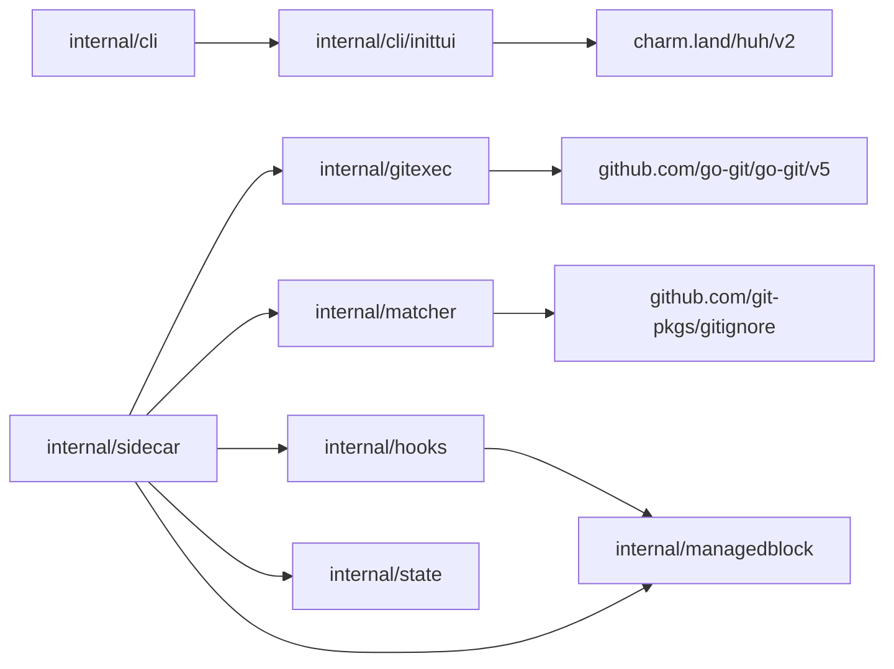

# Refactoring Analysis: Sidecar Library Adoption

> **Date**: 2026-05-06
> **Scope**: `internal/cli/inittui`, `internal/matcher`, `internal/gitexec`, `internal/sidecar`, `internal/hooks`, and `internal/state`
> **Analyzed by**: AI-assisted refactoring analysis using Martin Fowler's code-smell catalog
> **Language/Stack**: Go 1.26, Cobra CLI, Charm terminal UI stack, Git integration
> **Test Coverage**: Existing unit and E2E coverage plus targeted regression tests added in this refactor

---

## Executive Summary

The sidecar implementation had three high-leverage refactoring opportunities: custom terminal UI state, incomplete Git ignore semantics, and shell-heavy Git read paths. The implementation now adopts `charm.land/huh/v2` for the init form, `github.com/git-pkgs/gitignore` for real `.gitignore` semantics, and `github.com/go-git/go-git/v5` for local Git reads/staging/status while keeping shell Git where user behavior depends on Git itself.

The only P0 finding was behavioral: matching specs without honoring project ignore rules could silently index generated or dependency files. The remaining changes reduce duplicated block editing, expose command exit codes, and harden local state persistence without introducing unnecessary runtime services.

| Severity    | Count |
| ----------- | ----- |
| P0 Critical | 1     |
| P1 High     | 3     |
| P2 Medium   | 2     |
| P3 Low      | 0     |
| **Total**   | **6** |

### Top Opportunities

| #   | Finding                               | Location                                   | Effort      | Impact                                                         |
| --- | ------------------------------------- | ------------------------------------------ | ----------- | -------------------------------------------------------------- |
| 1   | Real gitignore matching               | `internal/matcher/matcher.go:28`           | moderate    | Fixes silent over-indexing of ignored files                    |
| 2   | Replace custom init TUI state machine | `internal/cli/inittui/model.go:34`         | moderate    | Cuts UI code and moves validation into declarative form fields |
| 3   | Hybrid go-git helpers                 | `internal/gitexec/git.go:32`               | significant | Removes fragile stdout parsing for local Git reads             |
| 4   | Shared managed block helper           | `internal/managedblock/managedblock.go:10` | trivial     | Removes duplicated marker-block replacement logic              |
| 5   | Durable private state writes          | `internal/state/state.go:34`               | trivial     | Prevents partial queue writes and keeps local logs private     |

---

## Findings

### P0 - Critical

#### F1: Matcher Ignored Project Gitignore Semantics

- **Smell**: Primitive Obsession / Missing Domain Abstraction
- **Category**: Change Preventer
- **Location**: `internal/matcher/matcher.go:28-85`
- **Severity**: P0 Critical
- **Impact**: `skeeper sync` could include `node_modules`, `dist`, generated Markdown, or other files a project already excludes from Git. This was silent and could pollute the sidecar history.

**Current Code**:

```go
ignored := newIgnoredMatcher(root)
if entry.IsDir() {
	if excluded(rel) || ignored.MatchPath(rel, true) {
		return filepath.SkipDir
	}
	loadNestedIgnore(root, rel, ignored)
	return nil
}
if excluded(rel) || ignored.MatchPath(rel, false) {
	return nil
}
```

**Recommended Refactoring**: Replace inline ignore policy with a Git-aware matcher library.

**Implemented**: `github.com/git-pkgs/gitignore` is used for root `.gitignore`, nested `.gitignore`, `.git/info/exclude`, and global excludes. Skeeper's own managed ignore block is stripped before matching so configured spec patterns remain discoverable.

**Rationale**: Gitignore matching is a protocol, not a glob helper. A dedicated wildmatch implementation handles directory-only rules, negation, nested scopes, and last-match-wins semantics more reliably than local string filtering.

---

### P1 - High

#### F2: Custom Init TUI State Machine Duplicated a Form Library

- **Smell**: Large Module / Conditional Complexity
- **Category**: Bloater
- **Location**: `internal/cli/inittui/model.go:34-140`
- **Severity**: P1 High
- **Impact**: The previous Bubble Tea model encoded form navigation, field visibility, validation, and submission branching by hand. Each new init flag had to be threaded through the model and tests.

**Current Code**:

```go
form := huh.NewForm(
	huh.NewGroup(
		huh.NewSelect[string]().
			Title("Mode").
			Options(
				huh.NewOption("Create new sidecar", initModeCreate),
				huh.NewOption("Use existing sidecar", initModeExisting),
			).
			Value(&state.mode),
	),
	// ...
).WithInput(input).WithOutput(output)
```

**Recommended Refactoring**: Replace custom form engine with `charm.land/huh/v2`.

**Implemented**: The exported `Run(ctx, input, output, defaults)` API now builds a declarative `huh.Form`, uses `WithHideFunc` for conditional groups, and keeps option normalization in pure helpers that are straightforward to test.

**Rationale**: `huh` shares the Charm ecosystem with Bubble Tea/Bubbles/Lip Gloss and directly models the form workflow needed here, removing a local abstraction that did not carry unique business logic.

---

#### F3: Git Read Paths Were Shell-Heavy and String-Parsed

- **Smell**: Shotgun Surgery / Feature Envy
- **Category**: Coupler
- **Location**: `internal/gitexec/git.go:32-261`, `internal/sidecar/service.go:265-646`
- **Severity**: P1 High
- **Impact**: Local metadata reads depended on command stdout shape and scattered `git rev-parse`, `git status`, and `git log` call sites. Adding behavior meant editing several shell invocations and tests.

**Current Code**:

```go
func (g *Git) IsDirty(ctx context.Context, dir string) (bool, error) {
	repo, err := openRepository(dir)
	if err != nil {
		return false, err
	}
	worktree, err := repo.Worktree()
	if err != nil {
		return false, err
	}
	status, err := worktree.Status()
	return !status.IsClean(), err
}
```

**Recommended Refactoring**: Move local Git reads to `go-git`, keep shell Git for porcelain operations that must preserve Git/user behavior.

**Implemented**: `internal/gitexec.Git` now owns `Root`, `GitDir`, `CurrentBranch`, HEAD metadata, ref checks, cleanliness, `add --all`, and ahead/behind counting. Shell execution remains for clone, switch, fetch, rebase, commit, push, and log output.

**Rationale**: `go-git` supports local status/add/ref/object reads but does not support rebase, and library commits/pushes can bypass user hooks or SSH config behavior. The hybrid boundary gives typed local reads without breaking user-visible Git semantics.

---

#### F4: Marker-Managed File Updates Were Duplicated

- **Smell**: Duplicated Code
- **Category**: DRY Violation
- **Location**: `internal/managedblock/managedblock.go:10-42`
- **Severity**: P1 High
- **Impact**: Hook and `.gitignore` block replacement had near-identical logic. Any edge-case fix for missing end markers, trailing newlines, or synced writes had to be applied twice.

**Current Code**:

```go
content := managedblock.Replace(string(data), gitignoreBegin, gitignoreEnd)
if strings.TrimSpace(content) == "" {
	content = block
} else {
	content = strings.TrimRight(content, "\n") + "\n\n" + block
}
```

**Recommended Refactoring**: Extract Function / Extract Module.

**Implemented**: Added `internal/managedblock` with shared `Replace` and synced `WriteFile`. `internal/hooks`, `internal/sidecar/gitignore.go`, and the matcher's managed-block stripping now use the same replacement semantics.

**Rationale**: The marker-block protocol is a shared local concern. Centralizing it reduces drift and lets tests pin the exact behavior.

---

### P2 - Medium

#### F5: Command Failures Hid Process Exit Codes

- **Smell**: Incomplete Error Object
- **Category**: Coupler
- **Location**: `internal/gitexec/runner.go:40-65`
- **Severity**: P2 Medium
- **Impact**: Callers could not branch on useful Git exit codes, such as code `1` from commands that use exit status for boolean answers.

**Current Code**:

```go
exitCode := -1
if cmd.ProcessState != nil {
	exitCode = cmd.ProcessState.ExitCode()
}
return result, &CommandError{ExitCode: exitCode, Err: err}
```

**Recommended Refactoring**: Encapsulate Process Result.

**Implemented**: `CommandError` now carries `ExitCode`, with `-1` for unavailable state, and has a regression test using a real failing command.

**Rationale**: Error values should expose structured facts. Keeping the exit code in the error avoids string parsing and supports future Git-specific branching.

---

#### F6: Local Queue Writes Were Not Atomic or Private Enough

- **Smell**: Temporal Coupling / Incomplete Persistence Boundary
- **Category**: Change Preventer
- **Location**: `internal/state/state.go:34-152`
- **Severity**: P2 Medium
- **Impact**: A crash during queue writes could leave a partial `queue.json`. Log files were created through append paths that needed explicit private-mode enforcement.

**Current Code**:

```go
if err := atomicWriteFile(filepath.Join(s.dir, queueFile), append(data, '\n'), 0o600); err != nil {
	return fmt.Errorf("write sync queue: %w", err)
}
```

**Recommended Refactoring**: Extract Persistence Boundary.

**Implemented**: `Enqueue` writes a temp file, syncs, closes, and renames over `queue.json`. `appendFile` creates/appends with `0600`, calls `Chmod(0600)`, syncs, and closes. Tests assert the private modes.

**Rationale**: Queue state drives retry behavior after hook failures. Atomic replacement and private permissions make that state robust without a dependency.

---

## Coupling Analysis

### Module Dependency Map



### High-Risk Coupling

| Module                  | Afferent                | Efferent                               | Risk   |
| ----------------------- | ----------------------- | -------------------------------------- | ------ |
| `internal/sidecar`      | CLI/tests               | config, gitexec, matcher, hooks, state | high   |
| `internal/gitexec`      | sidecar/tests           | os/exec, go-git                        | medium |
| `internal/matcher`      | sidecar/tests           | doublestar, gitignore, managedblock    | medium |
| `internal/managedblock` | hooks, sidecar, matcher | stdlib only                            | low    |

### Circular Dependencies

None detected.

---

## DRY Analysis

### Duplicated Code Clusters

| Cluster                                    | Locations                                                  | Extraction Strategy                                   |
| ------------------------------------------ | ---------------------------------------------------------- | ----------------------------------------------------- |
| Marker block replacement and synced writes | `internal/hooks/hooks.go`, `internal/sidecar/gitignore.go` | Extracted to `internal/managedblock`                  |
| Shell Git metadata parsing                 | `internal/gitexec/git.go`, `internal/sidecar/service.go`   | Consolidated behind typed `gitexec.Git` methods       |
| Form branching and field validation        | `internal/cli/inittui/model.go`                            | Replaced with declarative `huh` fields and validators |

### Magic Values

| Value                              | Suggested Constant                  | Status                                   |
| ---------------------------------- | ----------------------------------- | ---------------------------------------- |
| `0600` local state permissions     | local call-site permission argument | Kept explicit where file privacy matters |
| `750*time.Millisecond` hook budget | existing hook sync budget           | Unchanged; outside this refactor         |
| Skeeper block markers              | marker constants                    | Central replacement helper now shared    |

---

## SOLID Analysis

Skipped. This is a local-first CLI with service packages and small structs, not a domain-rich OO or DDD codebase where SOLID analysis would be the primary lens.

---

## External Library Notes

- `charm.land/huh/v2` was validated through Context7 against the v2.0.0 docs for `NewForm`, `NewGroup`, input/select/confirm fields, validators, and form execution. Source: <https://github.com/charmbracelet/huh/blob/v2.0.0/README.md>
- `github.com/git-pkgs/gitignore` was selected for Git-compatible wildmatch, nested `.gitignore`, `.git/info/exclude`, global excludes, negation, and `MatchPath` semantics. Sources: <https://pkg.go.dev/github.com/git-pkgs/gitignore> and <https://github.com/git-pkgs/gitignore>
- `github.com/go-git/go-git/v5` was kept in a hybrid boundary. Exa results confirmed `PlainOpenOptions`, `AddOptions{All:true}`, worktree `Status`, and the compatibility note that rebase is unsupported. Sources: <https://github.com/go-git/go-git/blob/v5.17.2/options.go>, <https://github.com/go-git/go-git/blob/v5.17.2/worktree_status.go>, and <https://github.com/go-git/go-git/blob/v5.17.2/COMPATIBILITY.md>

---

## Suggested Refactoring Order

### Phase 1: Bug Fix First

1. Replace matcher ignore handling with Git-compatible semantics.
2. Add regression tests for root `.gitignore`, nested `.gitignore`, `.git/info/exclude`, and skeeper managed-block stripping.

### Phase 2: Shrink Local Abstractions

1. Replace custom init TUI with `huh`.
2. Extract managed block replacement.
3. Harden state writes and command errors.

### Phase 3: Hybrid Git Boundary

1. Introduce typed go-git helpers.
2. Migrate read/status/stage call sites.
3. Keep shell Git where rebase, hooks, SSH config, and porcelain behavior matter.

---

## Risks and Caveats

- `huh` v2 is new relative to the rest of the stack; pinning the exact dependency is important.
- `go-git` v5 remains the stable line for this project; v6 is still alpha and carries API churn risk.
- `go-git` does not replace all Git usage. Rebase, commit hooks, push behavior, and SSH config are intentionally left to the real `git` binary.
- The matcher strips only skeeper's managed `.gitignore` block before applying project rules. This is intentional so skeeper can still find files it wrote ignore entries for, while project-authored ignores remain authoritative.
